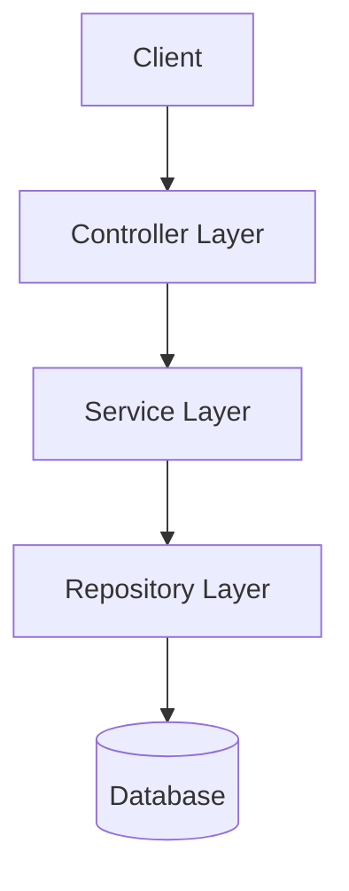
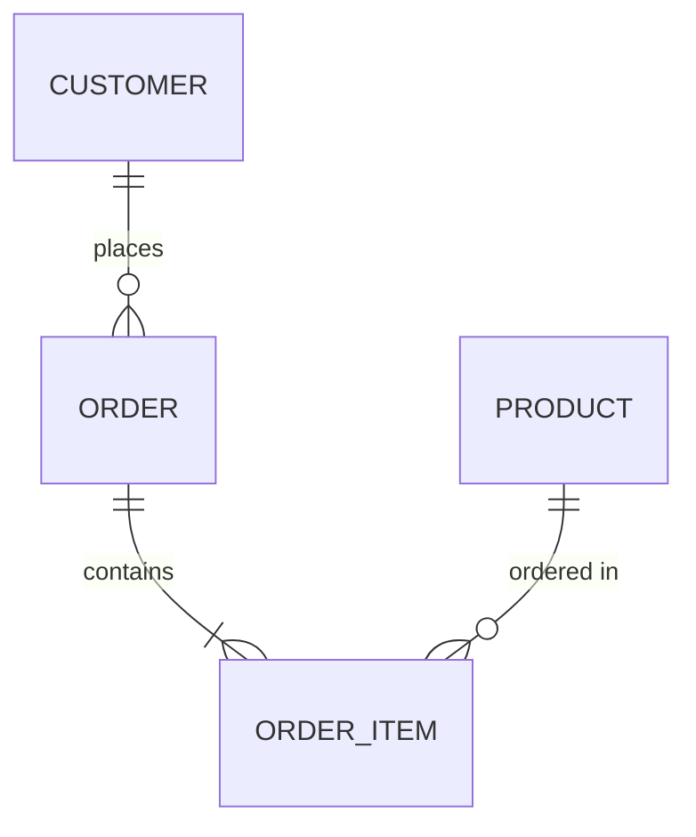
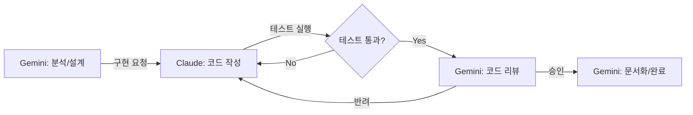

# 프로젝트 분석기 설계서

**작성일**: 2026-01-14
**작성자**: Claude Code
**상태**: 부분 구현 완료 (Scaffolding & DB Analyzer 완료, Phase 2-4는 프롬프트 가이드 방식)
**검토일**: 2026-01-14

---

## 1. 목표

기존 프로젝트를 AI가 분석하여:
1. 프로젝트 구조 파악 (완료)
2. 기능별 항목 분류 (프롬프트 가이드)
3. 문서/위키 자동 생성 (프롬프트 가이드)
4. (선택) DB에 메타데이터 저장 (완료)

---

## 2. 문제 정의

### 현재 상황
- 레거시 프로젝트는 문서가 부족하거나 outdated
- 새로운 개발자(또는 AI)가 프로젝트 파악에 시간 소요
- 기능 목록, API 정리, 코드 구조가 머릿속에만 존재

### 해결하고자 하는 것
- AI가 코드를 읽고 자동으로 문서화
- 기능별 분류 및 위키 생성
- 지속적 업데이트 가능한 구조

---

## 3. 제안하는 접근 방식

### Option A: Markdown 기반 위키 (권장)
```
project/
├── docs/
│   ├── README.md              # 프로젝트 개요
│   ├── architecture.md        # 아키텍처
│   ├── features/              # 기능별 문서
│   │   ├── index.md           # 기능 목록
│   │   ├── customer-mgmt.md   # 고객 관리
│   │   ├── sales-mgmt.md      # 영업 관리
│   │   └── ...
│   ├── api/                   # API 문서
│   │   ├── index.md
│   │   ├── customer-api.md
│   │   └── ...
│   └── codes/                 # 공통코드 정리
│       ├── index.md
│       └── code-tables.md
```

**장점**:
- Git으로 버전 관리
- GitHub/GitLab 위키로 바로 사용
- AI가 읽고 쓰기 쉬움
- 추가 인프라 불필요

### Option B: 실제 위키 시스템 (Notion, Confluence 등)
- API 연동 필요
- 더 풍부한 UI
- 검색/태그 기능

### Option C: SQLite/JSON 기반 로컬 DB
```
project/
├── .ai-metadata/
│   ├── project.db            # SQLite
│   ├── features.json
│   ├── apis.json
│   └── codes.json
```

**장점**:
- 구조화된 쿼리 가능
- AI가 특정 정보 빠르게 조회
- Node.js 스크립트로 조회/업데이트

---

## 4. 분석 파이프라인

### Phase 1: 프로젝트 스캔 (구현 완료)
```
Input: 프로젝트 경로
Output: 기본 구조 파악 및 컨텍스트 파일 생성

1. 빌드 파일 확인 (build.gradle, pom.xml, package.json)
2. 소스 폴더 구조 파악
3. 설정 파일 분석 (application.yml 등)
4. 의존성 목록 추출
5. docs/.analysis-context.md 생성
```

### Phase 2: 기능 분류 (프롬프트 가이드)
```
Input: docs/.analysis-context.md
Output: 기능별 분류

1. 사용자가 AI에게 컨텍스트 파일 전달
2. AI가 Controller/Service/Repository 패턴 파악
3. 패키지 구조로 도메인 분류
4. 주요 비즈니스 로직 식별
```

### Phase 3: 문서 생성 (프롬프트 가이드)
```
Input: 분석 결과
Output: Markdown 문서들

1. README.md 생성 (프로젝트 개요)
2. 기능별 문서 생성
3. API 문서 생성
4. 코드값 문서 생성 (DB 연동 시)
```

### Phase 4: 검증 및 보완 (수동)
```
Input: 생성된 문서
Output: 검증된 최종 문서

1. Gemini가 문서 리뷰
2. 누락된 부분 보완
3. 사용자 확인 요청
```

---

## 5. AI 역할 분담

| Phase | 담당 AI | 이유 |
|-------|---------|------|
| 1. 스캔 | Script | 파일 시스템 접근, 빠른 파싱 (analyze_project.sh) |
| 2. 분류 | Gemini/Claude | 긴 컨텍스트, 패턴 인식 (사용자 프롬프트) |
| 3. 문서 생성 | Gemini/Claude | 구조화된 글쓰기 (사용자 프롬프트) |
| 4. 검증 | Gemini | 전체 정합성 확인 |

---

## 6. 구현 계획

### Step 1: 기본 스크립트 (analyze_project.sh) - 완료
```bash
#!/bin/bash
# 프로젝트 분석 시작
PROJECT_PATH="$1"

# 1. 기본 정보 수집
# 2. 분석 컨텍스트 파일 생성
# 3. 사용자에게 AI 입력용 프롬프트 출력
```

### Step 2: 프롬프트 템플릿 - TODO
```
prompts/
├── scan_project.md      # Phase 1용 (스크립트 내장됨)
├── classify_features.md # Phase 2용
├── generate_docs.md     # Phase 3용
└── review_docs.md       # Phase 4용
```

### Step 3: 출력 템플릿 - 일부 완료
```
templates/
├── architecture.md       # 완료 (Mermaid 포함)
├── readme_template.md    # TODO
├── feature_template.md   # TODO
└── api_template.md       # TODO
```

---

## 7. 예시: AutoCRM 프로젝트 분석 시

### 입력
```
프로젝트 세트:
- AutoCRM_Core3
- AutoCRM_Core3_eclipselink
- AutoCRM_Samchully_BPS
```

### 예상 출력
```
AutoCRM_Samchully_BPS/docs/
├── README.md
│   - 프로젝트 개요
│   - 의존성: Core3 → Core3_eclipselink → Samchully_BPS
│   - 빌드 방법
│
├── architecture.md
│   - 3-tier 구조 (Controller/Service/Repository)
│   - 공통 모듈 관계도
│
├── features/
│   ├── index.md (기능 목록)
│   ├── customer-management.md
│   │   - 고객 등록/수정/삭제
│   │   - 관련 테이블: TB_CUSTOMER
│   │   - 관련 API: /api/customer/*
│   ├── sales-management.md
│   └── statistics.md
│
├── api/
│   ├── index.md
│   └── customer-api.md
│       - GET /api/customer/list
│       - POST /api/customer/save
│
└── codes/
    ├── index.md
    └── common-codes.md
        - CG0001: 고객 유형
        - CG0019: 권한 레벨
```

---

## 8. DB 메타데이터 저장 (Option C 선택 시)

### 스키마 예시 (SQLite)
```sql
-- 기능 테이블
CREATE TABLE features (
    id TEXT PRIMARY KEY,
    name TEXT,
    description TEXT,
    related_files TEXT,  -- JSON array
    related_apis TEXT,   -- JSON array
    updated_at DATETIME
);

-- API 테이블
CREATE TABLE apis (
    id TEXT PRIMARY KEY,
    method TEXT,
    path TEXT,
    controller TEXT,
    description TEXT,
    parameters TEXT,     -- JSON
    response TEXT        -- JSON
);

-- 코드값 테이블
CREATE TABLE code_values (
    group_code TEXT,
    code TEXT,
    name TEXT,
    description TEXT,
    PRIMARY KEY (group_code, code)
);
```

### 조회 예시
```javascript
// Node.js로 AI가 조회
const db = require('better-sqlite3')('.ai-metadata/project.db');

// 특정 기능 조회
const feature = db.prepare('SELECT * FROM features WHERE name LIKE ?').get('%고객%');

// 관련 API 조회
const apis = db.prepare('SELECT * FROM apis WHERE path LIKE ?').all('/api/customer%');
```

---

## 9. 장단점 비교

| 방식 | 장점 | 단점 |
|------|------|------|
| **Markdown 위키** | 간단, Git 연동, 바로 사용 | 구조화 쿼리 어려움 |
| **외부 위키** | 풍부한 UI, 검색 | API 연동 복잡, 비용 |
| **SQLite DB** | 빠른 쿼리, 구조화 | 초기 스키마 설계 필요 |
| **JSON 파일** | 간단, 가독성 | 대용량 시 느림 |

### 권장: Markdown 위키 + JSON 메타데이터

```
project/
├── docs/           # 사람이 읽는 문서 (Markdown)
└── .ai-metadata/   # AI가 빠르게 조회하는 데이터 (JSON)
    ├── project-info.json
    ├── features.json
    └── apis.json
```

---

## 10. 다음 단계

1. **Gemini 검토**: 이 설계의 실현 가능성 및 개선점
2. **프로토타입**: analyze_project.sh 기본 버전 작성
3. **테스트**: AutoCRM 프로젝트로 실제 테스트
4. **피드백 반영**: 결과물 품질 개선

---

## 11. Gemini 검토 결과 (2026-01-14, Gemini 작성)

### Q1. Markdown 위키 vs SQLite DB?

**결론: Markdown + JSON 하이브리드가 압도적으로 실용적**

- 개발자들은 IDE/Git을 떠나지 않고 싶어함
- `docs/` 폴더에 Markdown으로 존재해야 PR 리뷰 시 함께 검토 가능
- SQLite는 별도 뷰어 필요 → 가시성 떨어짐
- AI가 빠르게 참조할 정보만 JSON, 내용은 Markdown

### Q2. 기능 분류 자동화 정확도?

**예상 정확도: 70~85% (초기 실행 시)**

- **네이밍 컨벤션 준수 여부**에 따라 크게 좌우
- `CustomerController` → 90% 이상
- `C100Ctrl`, `Svc_01` → 50% 미만

**개선책**:
1. `import` 구문 + `public method` 시그니처 제공 시 정확도 상승
2. `mapping.json` 설정 파일로 사용자가 1회 교정 → 이후 100% 수렴

### Q3. DB 코드값 연동 시 보안 고려사항?

**가장 주의해야 할 부분**

- **소스 코드 내 enum/const**: 보안 문제 없음
- **실제 DB 조회**: 매우 위험
  - PII(개인정보)가 문서에 포함되어 Git에 올라갈 위험
  - DB 접속 정보가 설정 파일에 포함되어 커밋될 위험

**권고**: 문서화 대상은 **메타데이터(코드 정의, 컬럼 설명)**로 한정. 실제 데이터 값은 절대 포함 금지 또는 마스킹 필수.

### Q4. 문서 자동 업데이트 주기/트리거?

**On-Demand(수동 실행) 또는 Pre-push 추천**

- CI/CD마다 돌리면 토큰 비용 과다
- **추천 주기**:
  - Major/Minor 릴리즈 배포 전
  - 특정 기능 개발 완료 후 해당 모듈만
- `analyze_project.sh --diff` 옵션 필수 (변경된 파일 관련 문서만 갱신)

### Q5. 추가 고려사항

1. **Mermaid.js 다이어그램 자동 생성**
   - `architecture.md`에 ERD, Class Diagram, Sequence Diagram 포함
   - 텍스트 설명보다 다이어그램이 강력

2. **토큰 비용 견적 기능**
   - 분석 전 "약 $X.XX 비용이 예상됩니다. 진행하시겠습니까?" 표시
   - 레거시 프로젝트는 예상외로 방대할 수 있음

3. **.aiignore / .docignore 파일**
   - `node_modules`, `dist`, `test`, `generated` 등 제외
   - `.gitignore`와 별도로 관리

---

## 12. 설계 반영 사항 (v1.1, Gemini 작성)

Gemini 검토를 반영하여 다음 항목 추가:

### 12.1. .aiignore 파일 형식

```
# 분석 제외 대상
node_modules/
dist/
build/
.gradle/
target/
*.min.js
*.map
test/
__tests__/
generated/
```

### 12.2. analyze_project.sh 개선안

```bash
#!/bin/bash
# 프로젝트 분석 시작
PROJECT_PATH="$1"
MODE="${2:-full}"  # full | diff

# 0. 비용 견적 (토큰 계산)
estimate_cost() {
    TOTAL_SIZE=$(find "$PROJECT_PATH" -type f -name "*.java" -o -name "*.js" | xargs wc -c 2>/dev/null | tail -1 | awk '{print $1}')
    ESTIMATED_TOKENS=$((TOTAL_SIZE / 4))
    ESTIMATED_COST=$(echo "scale=2; $ESTIMATED_TOKENS * 0.00001" | bc)
    echo "예상 토큰: $ESTIMATED_TOKENS, 예상 비용: \$$ESTIMATED_COST"
    read -p "진행하시겠습니까? (y/n): " CONFIRM
    [ "$CONFIRM" != "y" ] && exit 0
}

# 1. .aiignore 적용
apply_ignore() {
    # .aiignore 파일 읽어서 제외 목록 생성
}

# 2. diff 모드 시 변경 파일만 분석
if [ "$MODE" = "diff" ]; then
    CHANGED_FILES=$(git diff --name-only HEAD~1)
fi

# 3. Claude에게 분석 요청
# 4. 결과를 docs/에 저장
```

### 12.3. architecture.md 템플릿 (Mermaid 포함)

```markdown
# 아키텍처

## 시스템 구조



## 엔티티 관계도


```

### 12.4. mapping.json (사용자 교정용)

```json
{
  "overrides": {
    "C100Ctrl.java": {
      "feature": "customer-management",
      "description": "고객 관리 컨트롤러"
    },
    "Svc_01.java": {
      "feature": "sales-management",
      "description": "영업 서비스"
    }
  },
  "exclude": [
    "LegacyHelper.java",
    "TestUtil.java"
  ]
}
```

---

## 13. 다음 단계 (수정)

1. ~~Gemini 검토~~ (완료)
2. ~~**프로토타입**: analyze_project.sh 기본 버전 작성 (비용 견적 포함)~~ (완료)
3. ~~**.aiignore 템플릿** 생성~~ (완료)
4. ~~**Mermaid 템플릿** 추가~~ (완료)
5. **테스트**: AutoCRM 프로젝트로 실제 테스트
6. **피드백 반영**: 결과물 품질 개선

---

## 14. 사람-AI 협업 워크플로우

AI 단독 분석의 한계를 보완하고 결과물의 정확도를 극대화하기 위해 사람과의 유기적인 협업 프로세스를 정의합니다.

### 14.1. 사람이 제공하는 입력 (Human Input)

AI 분석 시작 전, 사람은 다음과 같은 맥락 정보를 제공하여 분석의 정확도를 높입니다.

- **기초 지식 (Domain Knowledge)**
  - 비즈니스 용어집 (Glossary)
  - 프로젝트 특수 약어 및 명명 규칙
  - 핵심 비즈니스 로직에 대한 힌트
- **분석 범위 (Scope)**
  - 중점 분석 대상 (Core Features)
  - 분석 제외 대상 (Legacy, Deprecated)
  - 보안 민감 영역 (분석 제외 또는 마스킹 필요)
- **기존 문서 (Legacy Documents)**
  - 구버전 아키텍처 문서
  - 데이터베이스 스키마 (ERD)
  - API 명세서 (참조용)

### 14.2. 협업 옵션 (Collaboration Options)

프로젝트 규모와 요구사항에 따라 3가지 모드를 선택할 수 있습니다.

| 모드 | 설명 | 추천 상황 |
|------|------|-----------|
| **완전 자동 (Fully Automated)** | 사람 개입 없이 스캔부터 문서 생성까지 일괄 처리 | 초기 초안 작성, 소규모 프로젝트, 단순 구조 |
| **단계별 검토 (Step-by-Step)** | 각 단계(스캔→분류→생성)마다 사람의 승인 후 진행 | 대규모 프로젝트, 높은 정확도가 요구될 때 |
| **하이브리드 (Hybrid)** | 구조 파악은 자동, 핵심 로직 설명은 사람이 보완 | 일반적인 레거시 분석, 효율성과 정확도의 균형 |

### 14.3. 피드백 루프와 승인 프로세스

지속적인 품질 향상을 위한 순환 구조입니다.

1. **Draft 생성**: AI가 `docs/drafts/` 경로에 초안 문서 생성
2. **Review**: 개발자가 문서 검토 후 피드백 작성 (`feedback.md` 또는 PR 코멘트)
3. **Refine**: AI가 피드백을 반영하여 문서 수정 및 재작성
4. **Approve**: 개발자 최종 승인 시 `docs/` 메인 경로로 이동 및 병합
5. **Learn**: AI가 수정 패턴을 학습하여 다음 분석 시 반영 (프롬프트 최적화)

### 14.4. 설정 파일 예시 (.ai-analyzer.json)

협업 방식과 규칙을 정의하는 설정 파일입니다.

```json
{
  "mode": "hybrid",
  "human_input": {
    "domain_terms": {
      "VOC": "Voice of Customer",
      "BPS": "Business Process System"
    },
    "focus_modules": ["src/main/java/com/autocrm/api"],
    "security_level": "high"
  },
  "workflow": {
    "require_approval_steps": ["classification", "final_generation"],
    "feedback_file": "docs/feedback.md",
    "draft_folder": "docs/drafts",
    "auto_merge_threshold": 0.95
  }
}
```

---

## 15. AI 에이전트 크로스체크 자동화 (Future Goal)

최종 목표는 AI 에이전트들(Claude Code, Gemini CLI 등)이 서로의 결과물을 크로스체크하며 기능 완성을 자동화하는 것입니다.

### 15.1. 역할 분담

각 AI 에이전트의 특화된 능력을 활용하여 책임을 분리합니다.

| 에이전트 | 주요 역할 | 세부 책임 |
|----------|-----------|-----------|
| **Claude** | **Maker (구현/테스트)** | - 실제 코드 작성 및 수정<br>- 단위/통합 테스트 코드 작성<br>- 빌드 오류 수정 및 디버깅 |
| **Gemini** | **Reviewer (검토/문서화)** | - 아키텍처 및 설계 적합성 검토<br>- 보안 취약점 및 코드 품질 분석<br>- 기술 문서(README, API 명세) 작성 및 업데이트 |

### 15.2. 크로스체크 프로세스

한 AI가 작업을 완료하면 다른 AI가 이를 검증하여 오류를 최소화하고 품질을 높입니다.

1. **Task 할당**: 사용자가 Gemini에게 작업 지시
2. **설계 및 위임**: Gemini가 요구사항 분석 후 구현 계획 수립, Claude에게 구현 위임
3. **구현 및 1차 검증**: Claude가 코드 구현 및 테스트 실행 (Self-Correction)
4. **교차 검증**: Claude가 완료 보고를 하면 Gemini가 변경된 코드와 테스트 결과를 리뷰
5. **피드백 및 수정**: Gemini가 발견한 문제점을 Claude에게 피드백 (필요시 재구현 요청)
6. **최종 승인 및 문서화**: 검증 통과 시 Gemini가 관련 문서 업데이트 후 작업 완료

### 15.3. 자동화 파이프라인 예시



### 15.4. 무한루프 방지 규칙

AI 간의 수정 요청이 반복되는 것을 방지하기 위한 안전장치를 둡니다.

- **최대 교차검증 횟수**: 2회 (Initial -> Review -> Fix -> Re-review -> Fix -> Final Review)
- **2회 초과 시**: 강제 중단 및 사용자에게 개입 요청 (Human-in-the-loop)
- **비용 모니터링**: 각 단계별 토큰 사용량을 체크하여 설정된 한도 초과 시 중단

---

## 16. DB Analyzer 비대화형 모드 (v1.4, Claude 작성)

### 16.1. 문제점

기존 db_analyzer는 DB 설정이 불완전할 때 `readline`으로 대화형 입력을 요청합니다.
이 방식은 **AI 사용자(Claude Code, Gemini CLI 등)에서 작동하지 않습니다** - stdin 입력이 불가능하기 때문입니다.

```
[INFO] DB 설정이 불완전합니다.
DB 타입 (mysql/oracle/mssql/postgresql): <-- 여기서 막힘
```

### 16.2. 해결책: 템플릿 기반 워크플로우

`--non-interactive` 옵션으로 대화형 프롬프트 없이 실행:
- 누락된 정보를 JSON으로 출력
- 템플릿 파일 자동 생성 (`.ai-analyzer-template.json`)
- Exit code 2 반환 (사용자 개입 필요 표시)

### 16.3. 워크플로우 다이어그램

```
┌─────────────────────────────────────────────────────────────────┐
│  Step 1: db_analyzer --non-interactive --extract-from <path>    │
└─────────────────────────────────────────────────────────────────┘
                              │
                              ▼
              ┌───────────────────────────────┐
              │  설정 완전?                    │
              └───────────────────────────────┘
                     │              │
                    Yes            No
                     │              │
                     ▼              ▼
              ┌──────────┐  ┌──────────────────────────────────┐
              │ DB 분석   │  │ 1. 누락 정보 JSON 출력            │
              │ 실행      │  │ 2. 템플릿 파일 생성               │
              │ exit 0    │  │    → .ai-analyzer-template.json  │
              └──────────┘  │ 3. exit code 2 반환              │
                            └──────────────────────────────────┘
                                           │
                                           ▼
              ┌─────────────────────────────────────────────────┐
              │  Step 2: AI가 템플릿 읽고 사용자에게 DB 정보 질문  │
              │  → .ai-analyzer.json 으로 저장                   │
              └─────────────────────────────────────────────────┘
                                           │
                                           ▼
              ┌─────────────────────────────────────────────────┐
              │  Step 3: db_analyzer --config .ai-analyzer.json  │
              └─────────────────────────────────────────────────┘
```

### 16.4. Exit Code 정의

| Code | 의미 | 설명 |
|------|------|------|
| 0 | 성공 | DB 분석 완료 |
| 1 | 에러 | 연결 실패, 쿼리 오류 등 |
| 2 | 설정 필요 | 사용자 입력 필요 (템플릿 생성됨) |

### 16.5. 에러 분류 코드

| 코드 | 의미 | 설명 |
|------|------|------|
| `AUTH_FAILED` | 인증 실패 | 사용자명/비밀번호 오류 |
| `HOST_NOT_FOUND` | 호스트 없음 | DNS/네트워크 문제 |
| `CONNECTION_REFUSED` | 연결 거부 | 포트/방화벽 문제 |
| `TIMEOUT` | 타임아웃 | 연결 시간 초과 |
| `DATABASE_NOT_FOUND` | DB 없음 | 데이터베이스명 오류 |
| `PERMISSION_DENIED` | 권한 없음 | SELECT 권한 부족 |

### 16.6. 템플릿 파일 구조

```json
{
  "_meta": {
    "description": "DB 분석기 설정 템플릿. 값을 채운 후 .ai-analyzer.json으로 저장하세요.",
    "generated_at": "2026-01-14T14:00:00.000Z",
    "warning": "이 파일에 비밀번호를 직접 저장하지 마세요. 환경변수(${DB_PASSWORD})를 사용하세요."
  },
  "db": {
    "type": "<mysql|oracle|mssql|postgresql>",
    "host": "<DB 서버 주소>",
    "port": "<포트>",
    "database": "<데이터베이스명>",
    "user": "<사용자명>",
    "password": "${DB_PASSWORD}"
  },
  "options": {
    "limit": 100,
    "schema": null,
    "timeout": 5000
  }
}
```

### 16.7. 환경변수 치환

설정 파일에서 `${VAR_NAME}` 형식의 환경변수를 자동 치환합니다:

```json
{
  "db": {
    "password": "${DB_PASSWORD}"
  }
}
```

실행 시 `process.env.DB_PASSWORD` 값으로 대체됩니다.

### 16.8. 보안 고려사항

- `.ai-analyzer.json`을 `.gitignore`에 추가 권장 (경고 메시지 출력)
- 비밀번호는 환경변수 사용 권장
- 템플릿 파일(`_meta`)에 보안 경고 포함

### 16.9. 검증 결과 (AutoCRM)

```
테스트 DB: crmai_test (MSSQL, localhost:1433)
결과: 성공 - 4개 테이블 분석 완료
- client_details (2행)
- MASTER_CODES (0행)
- MASTER_GROUPS (0행)
- REQUEST_LOG (0행)
```

---

## 17. 구현 검증 결과 (2026-01-14, Gemini 작성)

설계 문서의 내용이 실제 코드로 구현되었는지 확인한 결과입니다.

### 17.1. 파일 및 스크립트 확인

| 항목 | 파일 경로 | 상태 | 비고 |
|------|-----------|------|------|
| **분석 스크립트** | `scripts/analyze_project.sh` | **완료** | 비용 견적, ignore 처리, DB 분석 연동 구현됨 |
| **DB 분석기** | `scripts/db_analyzer/index.js` | **완료** | Non-interactive 모드, 템플릿 생성, 에러 분류 구현됨 |
| **Mermaid 템플릿** | `templates/architecture.md` | **완료** | ERD, Sequence, Flowchart 템플릿 포함됨 |
| **AI Ignore** | `templates/.aiignore` | **완료** | 기본 제외 패턴 정의됨 |
| **AI 연동 자동화** | `scripts/analyze_project.sh` | **부분 완료** | 스크립트가 AI를 직접 호출하지 않고 프롬프트만 제공함 (Human-in-the-loop) |

### 17.2. 기능 상세 점검

1. **비용 견적 (Cost Estimation)**
   - `show_cost_estimate` 함수 구현 확인
   - 토큰 수 기반 예상 비용($) 계산 로직 포함

2. **비대화형 DB 분석 (Non-interactive DB Analysis)**
   - `--non-interactive` 플래그 처리 확인
   - 설정 누락 시 `EXIT_CONFIG_NEEDED (2)` 반환 및 템플릿 생성 확인

3. **환경변수 지원**
   - `${VAR_NAME}` 패턴 치환 로직 구현 확인 (`resolveEnvVariables`)

### 17.3. 종합 의견

설계 문서(v1.4)에 명시된 주요 기능이 모두 구현되었습니다. 특히 AI 에이전트가 개입할 수 없는 상황을 고려한 `Non-interactive` 모드와 `템플릿 기반 설정` 방식이 적절히 구현되어 있어, 자동화된 파이프라인 구성에 무리가 없을 것으로 판단됩니다.

다음 단계로는 실제 프로젝트 대상의 통합 테스트를 통해 엣지 케이스를 발굴하고 보완하는 과정이 필요합니다.

---

## 18. 향후 개발 계획 (Future Development Plan)

현재의 '반자동(Human-in-the-loop)' 단계를 넘어 완전 자동화를 위한 로드맵입니다.

### 18.1. 미구현 기능 및 고도화 대상
1.  **Phase 2~4 완전 자동화**
    -   현재: 스크립트가 프롬프트를 생성하면 사용자가 AI에게 입력
    -   목표: `analyze_project.sh`가 직접 Claude/Gemini API를 호출하여 결과물 생성까지 완료
2.  **완전 자율 크로스체크 에이전트 (Fully Autonomous Cross-Check)**
    -   현재: `cross_check.sh`가 라운드 관리만 하고, 실제 AI 호출은 사용자가 수행
    -   목표: AI Agent가 스스로 코드 수정, 커밋, 리뷰 요청을 수행하는 Loop 구현
3.  **마이크로서비스 의존성 심층 분석**
    -   현재: 프로젝트명 문자열 매칭 수준의 의존성 파악
    -   목표: API 호출(FeignClient, RestTemplate) 코드 분석을 통한 실제 호출 관계 도식화

---

## 19. 작업 로그 (Work Log)

### 2026-01-14
-   **다중 프로젝트 분석 지원 구현 (`analyze_project.sh`)**
    -   여러 프로젝트 경로를 인자로 받아 일괄 스캔하는 기능 추가
    -   프로젝트 간 의존성(참조 관계) 자동 감지 로직 구현
-   **문서 현행화 (Documentation Fix)**
    -   `README.md`: 신규 프로젝트 분석 가이드 추가
    -   `project-analyzer-design.md`: 구현 상태(부분 구현) 및 워크플로우 정정
-   **크로스체크 스크립트 상태 확인**
    -   `cross_check.sh`가 '프롬프트 가이드' 방식의 반자동 도구임을 확인하고 사용자에게 안내함