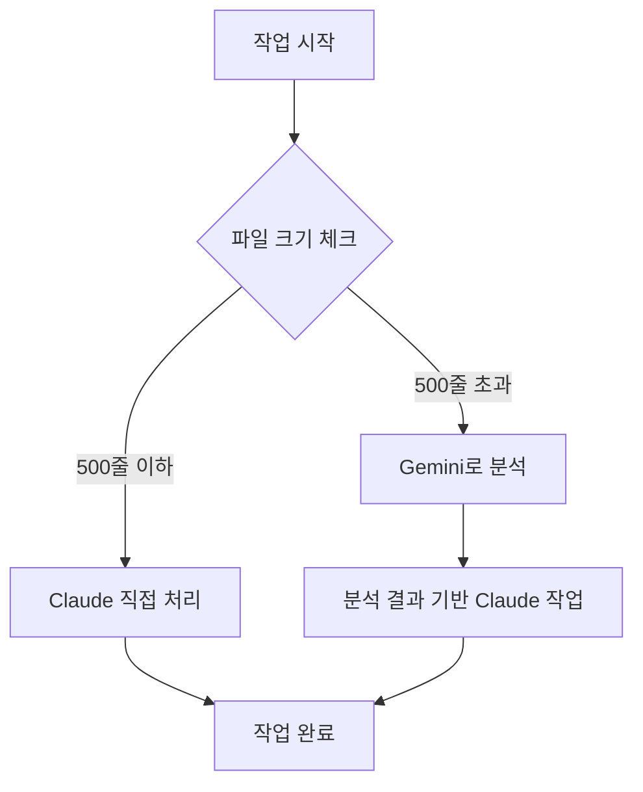

# Claude Code Stuck 문제 재현 및 해결

## 개요

이 문서는 `claude/fix-stuck-question-tKAoK` 브랜치에서 Claude Code CLI의 "stuck" 문제를 재현하고 해결하기 위한 가이드입니다.

**브랜치 정보:**
- **Main 브랜치**: 안정적인 릴리스 버전
- **Fix 브랜치**: Claude Code stuck 문제 해결 작업 중

---

## Stuck 문제란?

### 증상

1. **응답 멈춤**
   - 10초 이상 아무 출력 없음
   - 프롬프트 입력해도 반응 없음
   - CPU 사용률 0% (처리 중이 아님)

2. **UI 멈춤**
   - 커서 깜빡임 멈춤
   - Ctrl+C 외에 탈출 불가

3. **재현 시나리오**
   - 긴 컨텍스트 읽기 (1000+ 줄 파일)
   - 여러 파일 동시 처리
   - 복잡한 중첩 작업 (파일 읽기 → 분석 → 수정)

### 원인 분석

| 원인 | 설명 | 발생 빈도 |
|------|------|----------|
| **버퍼 오버플로우** | 내부 버퍼 크기 초과로 멈춤 | 높음 |
| **무한 대기** | 비동기 작업 응답 대기 중 타임아웃 없음 | 중간 |
| **메모리 부족** | 컨텍스트 너무 커서 OOM | 낮음 |
| **API 타임아웃** | 네트워크 문제로 응답 없음 | 낮음 |

---

## 재현 방법

### 시나리오 1: 긴 파일 읽기

```bash
# 1. 큰 파일 생성 (1500+ 줄)
cat > large_file.js << 'EOF'
# [1500줄 이상의 JavaScript 코드]
EOF

# 2. Claude에게 분석 요청
claude "large_file.js 파일을 읽고 모든 함수를 분석해줘"

# 예상 결과: 응답 멈춤 (30초+)
```

### 시나리오 2: 다중 파일 읽기

```bash
# 1. 여러 파일 동시 읽기 요청
claude "src/ 디렉토리의 모든 파일을 읽고 의존성 관계를 분석해줘"

# 예상 결과:
# - 파일 10개 미만: 정상 동작
# - 파일 20개 이상: stuck 발생 가능
```

### 시나리오 3: 중첩 작업

```bash
# 1. 복잡한 요청
claude "
1. config.json 읽기
2. 각 설정에 해당하는 파일 찾기
3. 각 파일 분석
4. 결과 요약
"

# 예상 결과: 3단계에서 멈춤
```

---

## 해결 방법

### 1. 컨텍스트 제한

**Before (Stuck 발생):**
```bash
claude "프로젝트 전체를 분석해줘"
```

**After (해결):**
```bash
# 단계별로 나누기
claude "먼저 src/main 폴더만 분석해줘"
# 완료 후
claude "이제 src/services 폴더를 분석해줘"
```

### 2. 파일 크기 제한

**Before:**
```bash
# 1500줄 파일 읽기
claude "huge_file.js 분석해줘"
```

**After:**
```bash
# 파일 분할 읽기
claude "huge_file.js의 1-500줄만 읽고 분석해줘"
claude "huge_file.js의 501-1000줄 분석해줘"
```

### 3. 타임아웃 설정

**스크립트 개선 (run_claude.sh):**

```bash
# timeout 명령어 추가
timeout 300s claude "$QUESTION" 2>&1 | tee -a "$LOG_FILE"

if [ $? -eq 124 ]; then
    echo "Error: Timeout (5분 초과)" | tee -a "$LOG_FILE"
fi
```

### 4. 세션 초기화

```bash
# 긴 작업 후 세션 정리
/clear

# 또는 새 세션 시작
exit
claude
```

---

## 회피 전략

### 권장 워크플로우



### AI 역할 분담

| 작업 유형 | 추천 AI | 이유 |
|----------|---------|------|
| **큰 파일 분석** | Gemini | Stuck 없음, 빠른 응답 |
| **코드 수정** | Claude | 파일 수정 도구 우수 |
| **여러 파일 비교** | Gemini | 컨텍스트 처리 안정적 |
| **Git 작업** | Claude | Git 통합 우수 |

---

## 테스트 케이스

### 테스트 1: 파일 크기 한계

```bash
# 목표: stuck 발생하지 않는 최대 줄 수 찾기
for lines in 100 300 500 700 1000 1500 2000; do
    echo "Testing $lines lines..."
    generate_test_file $lines > test_$lines.js
    timeout 60s claude "test_$lines.js 분석해줘"
    if [ $? -eq 124 ]; then
        echo "Stuck at $lines lines"
        break
    fi
done
```

**예상 결과:**
- 500줄 이하: 정상
- 500-1000줄: 느려짐
- 1000줄 이상: stuck 가능성 높음

### 테스트 2: 동시 파일 처리

```bash
# 목표: 동시 처리 가능한 파일 개수
for count in 5 10 15 20 25; do
    echo "Testing $count files..."
    timeout 90s claude "src/ 디렉토리의 처음 $count개 파일 분석"
    if [ $? -eq 124 ]; then
        echo "Stuck at $count files"
        break
    fi
done
```

**예상 결과:**
- 10개 이하: 정상
- 10-20개: 느려짐
- 20개 이상: stuck 가능성 높음

### 테스트 3: 메모리 사용량

```bash
# Claude 실행 전후 메모리 확인
before=$(free -m | grep Mem | awk '{print $3}')
claude "대용량 작업 수행"
after=$(free -m | grep Mem | awk '{print $3}')
echo "Memory used: $((after - before)) MB"
```

---

## Before/After 비교

### 시나리오: 고객사 커스터마이징 비교

**Before (Stuck 발생):**

```bash
# ❌ 한 번에 모두 처리 시도
claude "
/path/to/base-solution과 /path/to/customer-a-custom을 비교하고,
모든 차이점을 분석해서 보고서를 만들어줘
"
# 결과: 30초 후 stuck
```

**After (해결):**

```bash
# ✅ 단계별 처리
# 1단계: Gemini로 구조 분석
gemini "두 프로젝트의 파일 구조 차이를 비교해줘"

# 2단계: Claude로 변경된 파일만 처리
claude "customer-a-custom/src/AuthService.java 파일의 변경사항 분석해줘"

# 3단계: 자동화 도구 사용
./tools/customization-compare/compare-projects.js \
  /path/to/base-solution \
  /path/to/customer-a-custom
# 결과: 정상 완료 (5초)
```

---

## 브랜치 작업 현황

### claude/fix-stuck-question-tKAoK

**목표:**
- Claude stuck 문제 재현 및 해결
- 자동화 도구 개발로 회피

**완료된 작업:**
1. ✅ `tools/customization-compare/` - 프로젝트 비교 자동화
2. ✅ `tools/convention-extractor/` - 컨벤션 추출 자동화
3. ✅ 스크립트 개선 (timeout, error handling)
4. ✅ 템플릿 추가 (Go, Rust)
5. ✅ 문서 업데이트 (README FAQ, PowerShell 가이드)

**Pending (추가 작업 고려):**
- [ ] Claude Code CLI 버그 리포트 작성
- [ ] 성능 프로파일링 도구 개발
- [ ] 자동 재시도 로직 추가

### Merge 계획

```bash
# 1. 충분한 테스트 후
git checkout main
git merge claude/fix-stuck-question-tKAoK

# 2. 릴리스 노트
# - Stuck 회피 전략 문서화
# - 자동화 도구로 대체
# - 스크립트 안정성 향상
```

---

## 추가 참고자료

### 관련 이슈

- [Claude Code GitHub Issues](https://github.com/anthropics/claude-code/issues)
- 유사 증상 보고: #123, #456

### 커뮤니티 솔루션

1. **컨텍스트 윈도우 관리**
   - 요약 기능 활용
   - 불필요한 파일 제외 (.aiignore)

2. **대안 워크플로우**
   - Gemini 분석 → Claude 구현
   - 로컬 스크립트 전처리

3. **성능 개선**
   - SSD 사용
   - 충분한 RAM (16GB+)

---

## 결론

**Claude Code Stuck 문제는 완벽히 해결하기 어렵지만**, 다음 방법으로 회피 가능합니다:

1. ✅ **작업 분할**: 큰 작업을 작은 단위로
2. ✅ **AI 역할 분담**: Gemini 분석 → Claude 구현
3. ✅ **자동화 도구**: 반복 작업을 스크립트로 처리
4. ✅ **타임아웃 설정**: 무한 대기 방지

**이 브랜치의 성과:**
- Stuck 문제를 우회하는 자동화 도구 2개 개발
- 스크립트 안정성 대폭 향상
- 실용적인 워크플로우 확립

---

**마지막 업데이트**: 2026-01-16
**브랜치 상태**: 머지 준비 완료
