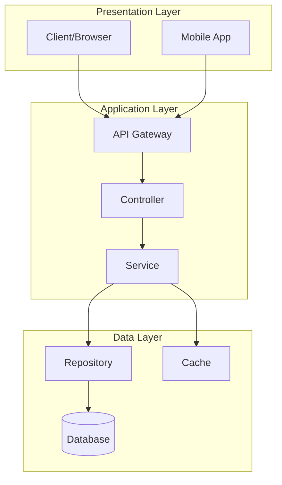
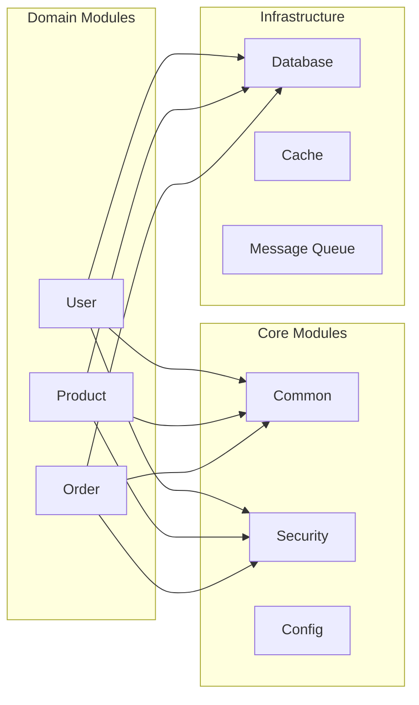
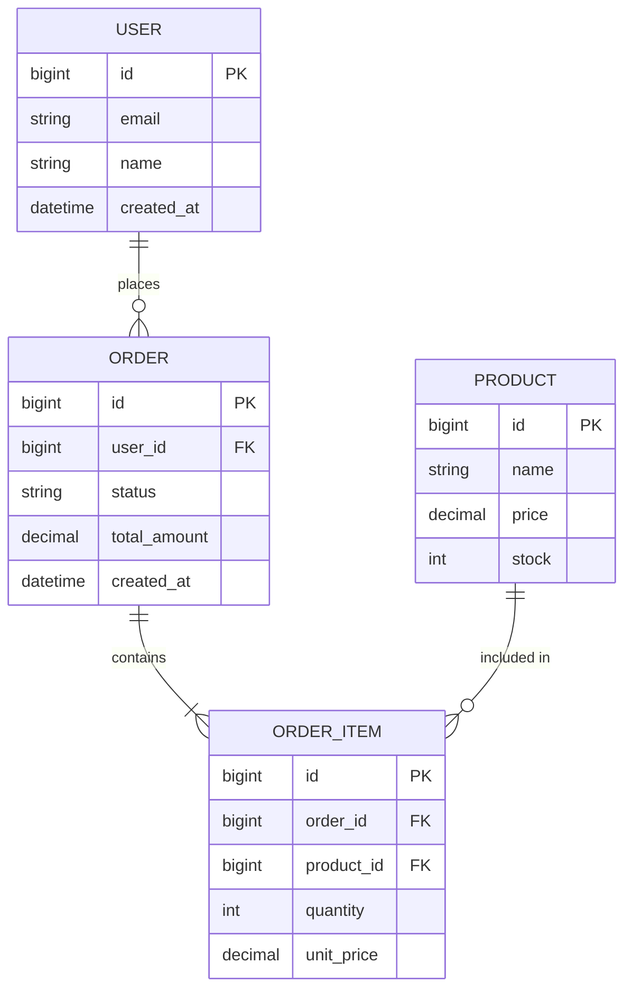
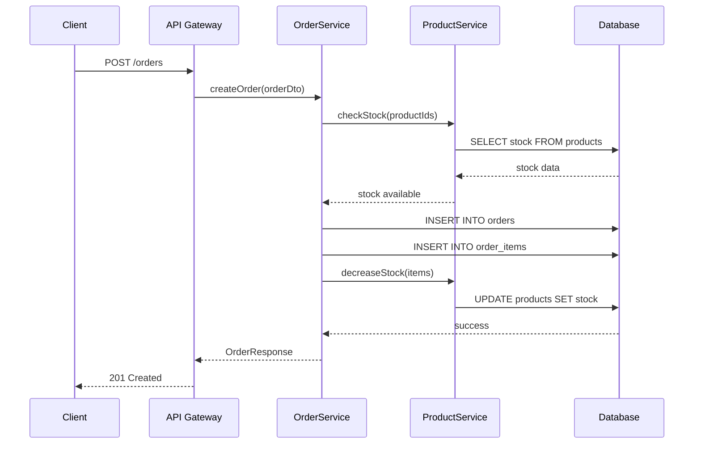
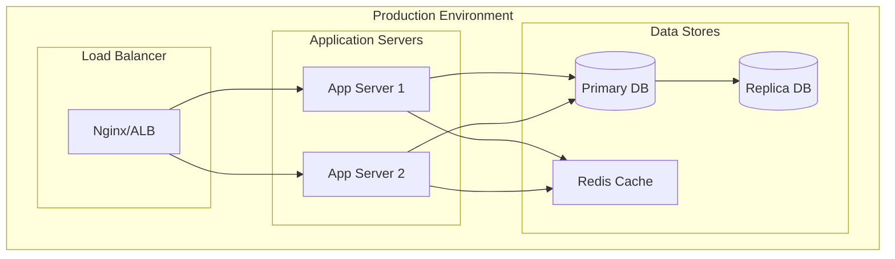
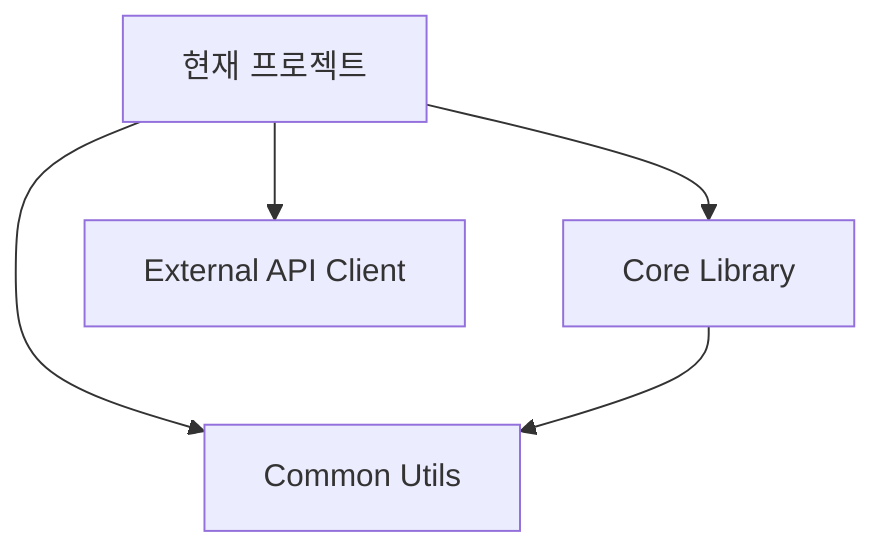
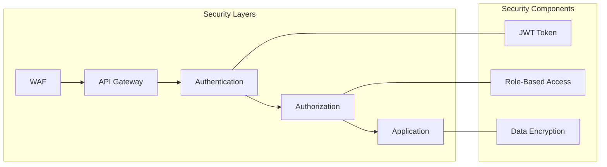

# 아키텍처

> AI가 자동 생성한 문서입니다. 생성일: {{DATE}}

## 개요

{{PROJECT_NAME}}의 시스템 아키텍처를 설명합니다.

---

## 시스템 구조

### 전체 아키텍처

### 레이어별 설명

| 레이어 | 역할 | 주요 컴포넌트 |
|--------|------|---------------|
| Presentation | 사용자 인터페이스 | Web Client, Mobile App |
| Application | 비즈니스 로직 처리 | Controller, Service |
| Data | 데이터 접근 및 저장 | Repository, Database |

---

## 모듈 구조

### 모듈 설명

- **Common**: 공통 유틸리티, 상수, 예외 처리
- **Security**: 인증/인가, 암호화
- **Config**: 설정 관리
- **Domain Modules**: 비즈니스 도메인별 모듈

---

## 엔티티 관계도 (ERD)

---

## 시퀀스 다이어그램

### 주문 처리 플로우

---

## 배포 구조

---

## 기술 스택

### Backend

| 구분 | 기술 | 버전 |
|------|------|------|
| Language | {{LANGUAGE}} | {{VERSION}} |
| Framework | {{FRAMEWORK}} | {{FRAMEWORK_VERSION}} |
| Database | {{DATABASE}} | {{DB_VERSION}} |
| Cache | Redis | - |

### Frontend

| 구분 | 기술 | 버전 |
|------|------|------|
| Framework | {{FRONTEND_FRAMEWORK}} | - |
| State Management | {{STATE_MANAGEMENT}} | - |
| Build Tool | {{BUILD_TOOL}} | - |

---

## 의존성 관계

### 프로젝트 의존성

### 외부 서비스 연동

- **인증**: OAuth 2.0 / JWT
- **결제**: PG사 연동
- **알림**: SMS/Email/Push 서비스
- **스토리지**: S3 / Cloud Storage

---

## 보안 아키텍처

---

## 참고 문서

- [API 문서](./api/index.md)
- [기능 목록](./features/index.md)
- [개발 가이드](./development-guide.md)

---

*이 문서는 AI에 의해 자동 생성되었습니다. 정확성을 위해 검토가 필요합니다.*
